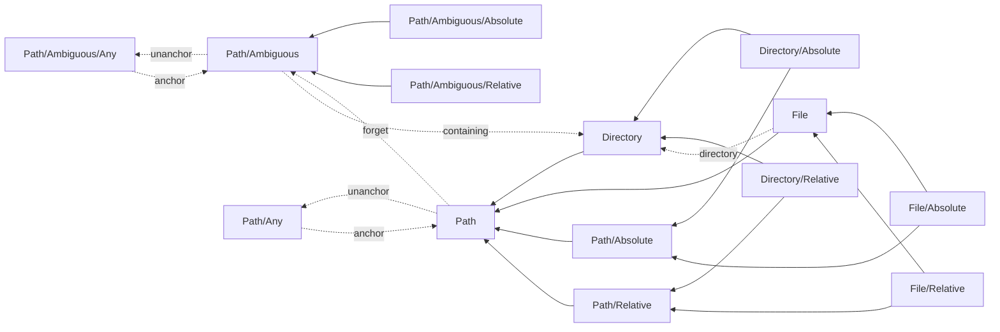

[](https://garnix.io)

# Paths (for Dhall)

Well-typed path manipulation for Dhall

This library offers two primary path representations
- `Path` and
- `Path/Ambiguous`.

`Path` takes two type parameters, one indicating whether the path is absolute or relative (`Path/Anc`) and one indicating whether it is a file or directory (`Path/Typ`). The latter only takes the `Path/Anc` parameter. Ambiguous paths can’t know whether they represent a file or directory. However, some operations (like `containing`) can bridge to non-ambiguous paths (since we know that regardless of what an ambiguous path represents, its containing path _must_ be a directory).

There are two other path representations, corresponding to the two above,
- `Path/Any` and
- `Path/Ambiguous/Any`.

These are structured the same as the primary ones, but don’t carry type information around. They are mostly intended for interfacing with systems that don’t make those distinctions (e.g., in Nix, basically all uses of paths accept any of the four possible `Path` structures, so it is simpler to expose a single type covering all of them than a union of the distinct types). However, these are also used internally to simplify things like `toText`.

The stronger types of `Path` and `Path/Ambiguous` can always be recovered from the corresponding unanchored path type ([`Path/anchor`](./dhall/Path/anchor)), so operations are _only_ provided on “anchored” types, with the expectation of converting the type at interface boundaries as necessary.

There are also aliases for full and partial applications of `Path/Anchored`. Operations are defined for the most specific types possible, e.g., `Directory/Absolute/isRoot`, not `Directory/isRoot` or `Path/isRoot`. In some cases (like `isRoot`), this is because the function is undecidable in other cases. Without access to the file system, we can’t determine whether “../../../” is the root directory or not.

This type DAG not only shows all the aliases, but lists some operations (the labled, dotted edges) that move between otherwise unconnected types. This is not a full diagram of the operations on paths, or even the subset of unary operations.


The only failure cases in this library is when some relative path has too much re-parenting (“../”) relative to some other path such that the operation is impossible. This is represented by a `None` result.

## abstract API

These is a rough set of available operations. The actual implementations may be duplicated on multiple more specific types. This splits out the cases that have distinct result types (usually because one may fail).

- `anchor` – realize the types in the path
  - `Path/anchor: Path → < AbsDir : Directory/Absolute | AbsFile : File/Absolute | RelDir : Directory/Relative | RelFile : File/Relative >`
  - `Path/Ambiguous/anchor: Path/Ambiguous → < Abs : Path/Absolute/Ambiguous | Rel : Path/Relative/Ambiguous >`
- `ascend` – move up one level in the file hierarchy
  - `Directory/Absolute/ascend : Directory/Absolute → Optional (Directory/Absolute)`
  - `Directory/Relative/ascend : Directory/Relative → Directory/Relative`
- `basename : File anchor → Text` – get the name of the file referred to by the path
- `concat` – resolve a path relative to another one
  - `Directory/Absolute/concat : Directory anchor → Path/Relative type → Optional (Path/Anchored anchor type)`
  - `Directory/Relative/concat : Directory anchor → Path/Relative type → Path/Anchored anchor type`
- `containing : Path/Ambiguous anchor → Directory anchor` – find the containing directory for an ambiguous path
  - `Directory/Relative/ascend : Directory/Relative → Directory/Relative`
- `current : Directory/Relative` – the current directory, the starting point for building relative paths
- `descendThrough : Directory anchor → List Text → Directory anchor` – move multiple directories deeper in the file system
- `descendTo : Directory anchor → Text → Directory anchor` – like `descendThrough`, but for a single directory
- `directory : File anchor → Directory anchor` – find the directory containing the file
- `encapsulate : Directory/Absolute → Path/Relative type → Optional (Path/Relative type)` – sandboxes paths
- `forget` – forget whether a path is a file or a directory (making a path an ambiguous path)
  - `Directory/forget : Directory anchor → Optional (Path/Anchored/Ambiguous anchor)`
  - `File/forget : File anchor → Path/Anchored/Ambiguous anchor`
- `isCurrent` - identify whether the directory is the current directory
- `isRoot` - identify whether the directory is the root directory
- `reparent : Path[/Ambiguous]/Relative type → Path[/Ambiguous]/Relative type` – shift the directory one level higher in the file system
- `reparentBy : Path[/Ambiguous]/Relative type → Natural → Path[/Ambiguous]/Relative type` – shift the directory some number of levels higher in the file system
- `root : Directory/Absolute` – the root directory, the starting point for building absolute paths
- `route` – find a path from the first path to the second
  - `Path/Absolute/route : Directory/Absolute → Path/Absolute type → Path/Relative type`
  - `Path/Relative/route : Directory/Relative → Path/Relative type → Optional (Path/Relative type)`
- `selectFile : Directory anchor → Text → File anchor`
- `toText : Format → Path/[Ambiguous/]Any → Text` – serialize the path (formatted for specific systems)
- `unanchor` – generalize the type, for interfaces
  - `Path/unanchor : Path anchor type → Path/Any`
  - `Path/Ambiguous/unanchor : Path/Ambiguous anchor → Path/Ambiguous/Any`

## future ideas

### distinguish re-parented paths from relative paths?

This could reduce the scope of some failures. It’s also possible that some systems can’t directly express re-parenting, and they would be able to distinguish that at the type level.

## expectations for consumers

The paths are normalized (but not canonicalized, as we have no IO).

## internals

Structurally, paths look like
```dhall
λ(ancType : Type) →
λ(typType : Type) →
  { parents : ancType, directories : List Text, file : typeType }
```
with one very minor variation – `Ambiguous` paths call `file` `component` (because the ambiguity is that we don’t know whether that component represents a directory name or a file name).

The `directories` are stored in reverse order, to make the common operations of cons, tail, fold, etc. a bit more intuitive[^1].  `ancType` is `{}` for absolute paths, `Natural` for relative paths, and `Optional Natural` for un-anchored paths. Similarly, `typType` is `{}` for directories, `Text` for files, and `Optional Text` for un-anchored paths.

[^1]: **TODO**: Perhaps switch to a non-reverse ordering, since Dhall’s types are structural, the ordering is exposed, even if we generally try to prevent users from seeing it. Keeping it consistent would be good to avoid confusion.

## development environment

We recommend the following steps to make working in this repo as easy as possible.

### `direnv allow`

This command ensures that any work you do within this repo is done within a consistent reproducible environment. That environment provides various debugging tools, etc. When you leave this directory, you will leave that environment behind, so it doesn’t impact anything else on your system.

### `git config --local include.path ../.config/git/config`

This will apply our repo-specific Git configuration to `git` commands run against this repo. It is very lightweight (you should definitely look at it before applying this command) – it does things like telling `git blame` to ignore formatting-only commits.

## building & development

`nix build` will build and test the project fully.

`nix develop` will put you into an environment where the traditional build tooling works. If you also have `direnv` installed, then you should automatically be in that environment when you're in a directory in this project.

## comparisons

### `path` & `pathy`

This library was inspired by the [Haskell](https://hackage.haskell.org/package/path) `path` library and the [PureScript](https://github.com/purescript-contrib/purescript-pathy) & [Scala](https://github.com/precog/scala-pathy) `pathy` libraries. However, it differs from them in several ways.

For one, it supports `../` (unlike Haskell’s `path`). Avoiding re-parenting does nothing to eliminate failure cases, it just shifts them to different places. Avoiding escaping some scope can be handled via a “chroot”-style approach, using `encapsulate`.

Being in Dhall, it can’t support parsing strings, so it can never convert `Text` to `Path`. Since they must be held in a structured format anyway (which is good, regardless), it means that there is no system-specific awareness outside of the `toText` operation.

It supports a notion of “ambiguous” paths that are not either directories or files. This is due to its need to act as an interface to arbitrary systems.

Since Dhall can’t compare strings, we can’t identify or remove common prefixes. The closest approximation is `route`, which removes a prefix by re-parenting.
